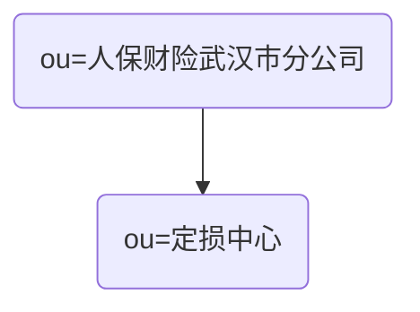

# 统一用户管理系统

本系统用于为其它应用提供一套完整的用户管理解决方案。

## 技术栈

- OpenLDAP
- redis

## Stage 1

为快速配合 vue-admin-template 项目的开发，第一阶段只实现了三个 API：

- /login：通过用户名和密码登录，返回 token
- /info?token=xxx：通过 token 获取用户信息
- /logout：登出

## approval-system 相关设计

### 组织机构（organizationalUnit）

### 角色（groupOfNames）

| role         | description                        |
| ------------ | ---------------------------------- |
| 定损员       | 定损员                             |
| 组长         | 组长                               |
| 主任         | 主任                               |
| 包干修复初审 | “包干修复”初审，必须同时属于`组长` |
| 高价值件初审 | “高价值件”初审，必须同时属于`组长` |
| 总成部件初审 | “总成部件“初审，必须同时属于`组长` |
| 调价申请初审 | ”调价申请“初审，必须同时属于`组长` |

### 人员（inetOrgPerson）

| userid    | name | role               |
| --------- | ---- | ------------------ |
| xiawei    | 夏伟 | 定损员             |
| guoping   | 郭平 | 定损员             |
| zhangyang | 张洋 | 组长，包干修复初审 |
| lijie     | 李捷 | 组长，高价值件初审 |
| fengming  | 冯明 | 组长，总成部件初审 |
| wuchao    | 吴超 | 组长，调价申请初审 |
| yuyong    | 于勇 | 主任               |

### REST API
